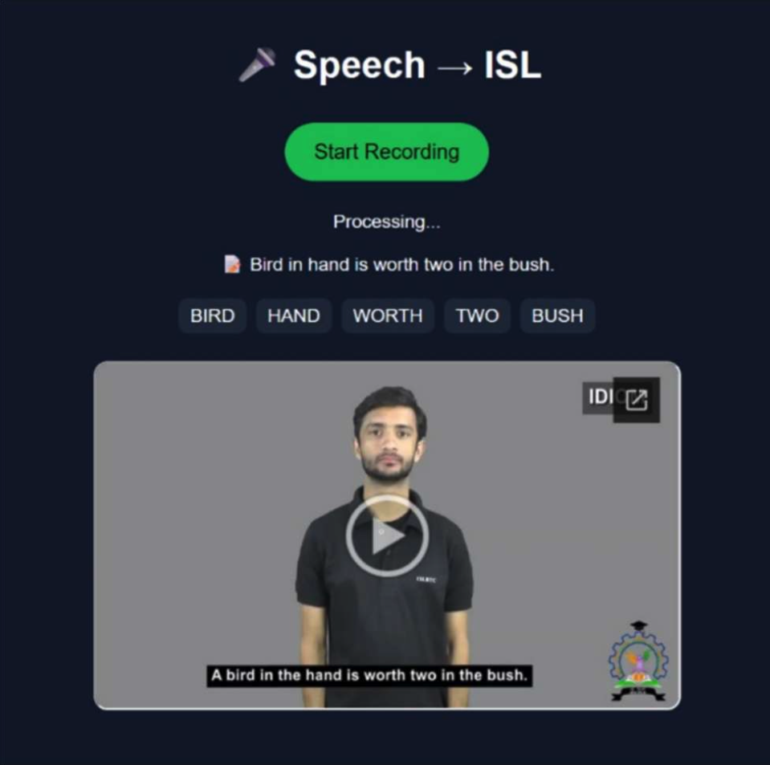
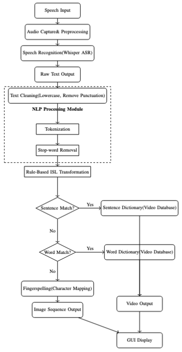
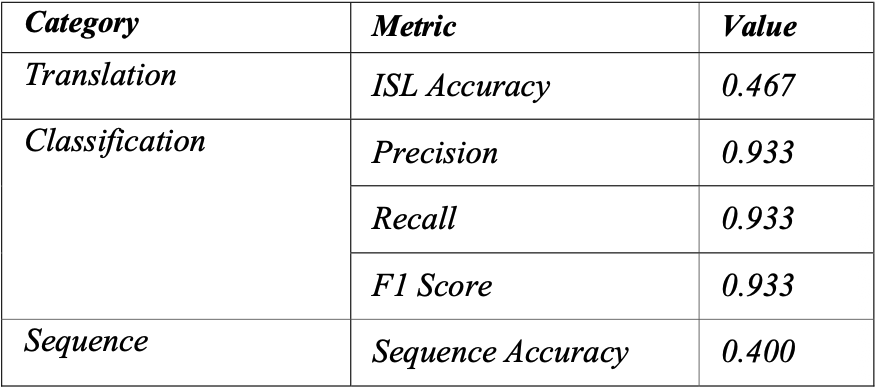

#  Speech-to-ISL Avatar

### AI-Based Speech to Indian Sign Language (ISL) Translation System

---

##  Overview

This project presents a **Speech-to-Indian Sign Language (ISL) translation system** designed to bridge the communication gap between spoken language users and the deaf community.

The system converts spoken English into **ISL video sequences or fingerspelling output** using a combination of:

* Automatic Speech Recognition (ASR)
* Natural Language Processing (NLP)
* Rule-based ISL translation

It focuses on **lightweight, modular, and real-time communication support**.

---

##  System Output



---

## Problem Statement

Communication barriers exist between hearing individuals and the deaf community due to the lack of accessible translation tools.

This project aims to:

* Convert speech into ISL
* Provide visual sign output
* Ensure accessibility and usability in real-world scenarios

---

## Methodology

# System Workflow



The system follows a multi-stage pipeline:

1. **Speech Input**

   * Audio captured via microphone

2. **Speech Recognition**

   * Whisper ASR converts speech → text

3. **NLP Processing**

   * Text cleaning
   * Tokenization
   * Stop-word removal

4. **ISL Translation**

   * Rule-based grammar transformation
   * Sentence-level matching
   * Word-level matching
   * Fallback: Fingerspelling

5. **Output Generation**

   * Video sequence display
   * Image-based character output

---

## Tech Stack

* **Programming Language:** Python
* **Speech Recognition:** Whisper ASR
* **NLP:** spaCy
* **Frontend:** HTML, CSS, JavaScript
* **Audio Processing:** SoundDevice
* **Storage:** Google Drive API
* **Backend:** Python-based modular system

---

## Project Structure

```
backend/
├── isl_dictionary/
├── nlp_processing/
├── speech_to_text/
├── utils/
├── templates/

main.py
app.py
requirements.txt
```

---

## Results

# Performance Metrics



* **Precision:** 0.933
* **Recall:** 0.933
* **F1 Score:** 0.933
* **ISL Accuracy:** 0.467
* **Sequence Accuracy:** 0.400

> High token-level performance with scope for improvement in grammatical sequencing.

---

## System Features

✔ Real-time speech-to-text conversion
✔ ISL video-based output
✔ Sentence & word-level mapping
✔ Fingerspelling fallback mechanism
✔ Modular and scalable architecture
✔ Lightweight and portable design

---

##  How to Run

1. Clone the repository:

```
git clone https://github.com/your-username/speech-to-isl-avatar.git
cd speech-to-isl-avatar
```

2. Install dependencies:

```
pip install -r requirements.txt
```

3. Run the application:

```
python app.py
```

4. Open browser and interact with the interface

---

## Future Improvements

* Improve ISL grammar accuracy
* Integrate deep learning / transformer-based translation
* Replace Google Drive with scalable cloud storage
* Expand ISL dataset coverage
* Add avatar-based sign generation

---

## Contributors

* Divyansh Singh
* Rohnit Sethi

---

##  Research Paper

Refer to the full research paper for detailed methodology and evaluation:
(Attach your paper PDF here in repo)

---

##  Impact

This project contributes towards:

* Inclusive communication
* Assistive AI technology
* Bridging accessibility gaps

---

##  Acknowledgements

* OpenAI Whisper
* spaCy NLP
* Public ISL datasets

---
